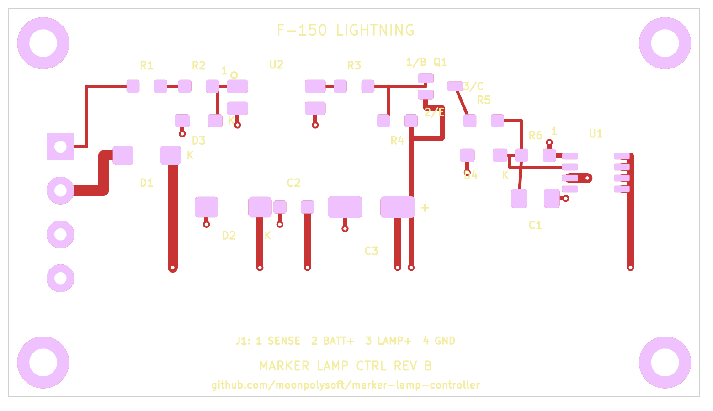

# F-150 Lightning Auxiliary Marker-Lamp Controller

An open-hardware controller that makes aftermarket amber grille marker lamps
follow the factory parking lamps on a 2023 Ford F-150 Lightning—without using
the CAN bus or trailer-lighting outputs.



## Status

- Revision A was assembled, bench tested, and verified in the vehicle.
- The selected driver-side rear parking-lamp signal provides the desired lamp
  behavior. No front-lamp or CAN connection is required.
- Revision B corrects the three assembly issues found on Revision A and has
  been submitted to OSH Park. Fabricated Revision B hardware is not yet tested.
- The current enclosure prototype has been printed and its mechanical fit is
  confirmed, including the revised connector opening, boss clearances, and
  recessed lid screws.

This remains a hobbyist engineering prototype, not a Ford-approved accessory
or a safety-certified automotive product. Read [Safety](#safety) before
building or installing it.

## What it does

The controller senses the factory rear parking-lamp output through an
optocoupler and drives the aftermarket LEDs from a separate fused 12 V supply
using a protected high-side switch. The factory lamp circuit supplies only the
sense current; it does not power the added lamps.

```text
Factory rear parking-lamp output ── isolated sense/filter ──┐
                                                            │
Fused 12 V supply ── protected high-side switch ── marker lamps
Vehicle ground ─────────────────────────────────── marker return
```

The tested aftermarket lamp assembly draws approximately 0.25 A with the
vehicle low-voltage system energized. The observed sense signal reads roughly
6 V with the truck off and 8 V with it on when measured by a multimeter,
consistent with a pulse-width-modulated automotive lamp output.

## Repository contents

| Path | Contents |
|---|---|
| [`hardware/kicad/`](hardware/kicad/) | KiCad boards, deterministic PCB generator, BOM, DRC reports, Gerbers, drill files, and OSH Park upload archives |
| [`hardware/controller-design.md`](hardware/controller-design.md) | Circuit architecture, component rationale, and validation notes |
| [`enclosure/`](enclosure/) | Parametric OpenSCAD enclosure source and printable STL exports |
| [`docs/rear-parking-wire-test.md`](docs/rear-parking-wire-test.md) | Procedure used to identify and verify the vehicle signal |

Revision B is the current PCB. Revision A files remain available as design
history but include known assembly defects; do not order Revision A.

## Building the board

The easiest fabrication input is:

[`hardware/kicad/fabrication-rev-b/marker-lamp-controller-rev-b-oshpark.zip`](hardware/kicad/fabrication-rev-b/marker-lamp-controller-rev-b-oshpark.zip)

The board is a two-layer, 80 × 45 mm design made for OSH Park's standard
two-layer service. Review the current [`BOM.csv`](hardware/kicad/BOM.csv),
because distributor stock and manufacturer lifecycle status change over time.
Connector pinout, board specifications, regeneration instructions, and known
Revision A defects are documented in the
[`hardware/kicad/README.md`](hardware/kicad/README.md).

To regenerate the PCB source with KiCad 10's Python environment:

```sh
python3 hardware/kicad/generate_pcb.py
```

The generator and
[`circuit-netlist.md`](hardware/kicad/circuit-netlist.md) are the authoritative
circuit sources. This project currently does not contain a conventional KiCad
schematic.

## Printing the enclosure

Open [`controller_enclosure.scad`](enclosure/controller_enclosure.scad) in
OpenSCAD and select `base` or `lid`, or print the supplied STL files. See the
[`enclosure/README.md`](enclosure/README.md) for hardware dimensions, material
recommendations, and print settings. The lid should be printed with a 5 mm
brim.

## Installation summary

J1 uses a Same Sky `TBP01R1-508-04BE` board header with a
`TBP01P1-508-04BE` wire-side plug:

| Pin | Signal | Connection |
|---:|---|---|
| 1 | `SENSE` | Verified parking-lamp signal tap |
| 2 | `BATT+` | Separately fused 12 V supply |
| 3 | `LAMP+` | Switched positive output to marker LEDs |
| 4 | `GND` | Chassis ground and lamp return |

Place the branch fuse near the power source. The design documentation calls
for a 2 A fuse and 18 AWG automotive primary wire for the tested 0.25 A load.
Confirm wiring, fuse size, polarity, and connector numbering against your own
vehicle and hardware; model-year and trim wiring can differ.

## Safety

Automotive electrical systems can produce load-dump, inductive, reverse-
polarity, and electrostatic transients. A wiring fault can damage vehicle
modules or start a fire. Disconnect the low-voltage battery as directed by the
vehicle service procedure before permanent wiring, protect added conductors
with an appropriately placed fuse, use automotive-rated wire and abrasion
protection, and secure the assembly away from heat, water, sharp edges, and
moving parts.

Do not treat a zero-error DRC result as validation of electrical safety. Test
every assembled board with a current-limited bench supply before vehicle use.
You build and install this project at your own risk.

Ford and F-150 Lightning are trademarks of their respective owner. This
project is independent and is not affiliated with or endorsed by Ford Motor
Company.

## Contributing

Bug reports, measurements, documentation corrections, and design improvements
are welcome. See [`CONTRIBUTING.md`](CONTRIBUTING.md) before submitting a
change. In particular, identify the PCB revision and vehicle model year/trim
when reporting electrical behavior.

## License

This project is open hardware licensed under the
[CERN Open Hardware Licence Version 2—Strongly Reciprocal](LICENSE), SPDX
identifier `CERN-OHL-S-2.0`.

You may use, study, modify, manufacture, and distribute the design subject to
the licence terms. The strongly reciprocal variant was selected so that
distributed modified designs and products remain accompanied by corresponding
design source. The licence includes warranty and liability disclaimers; it is
not a certification of fitness for automotive use.
